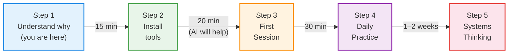
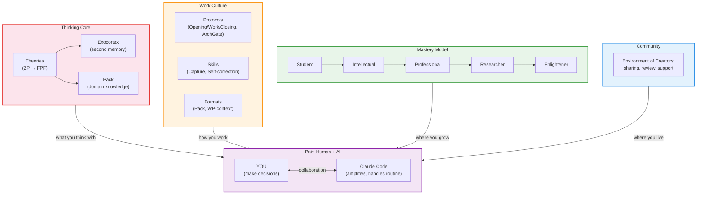
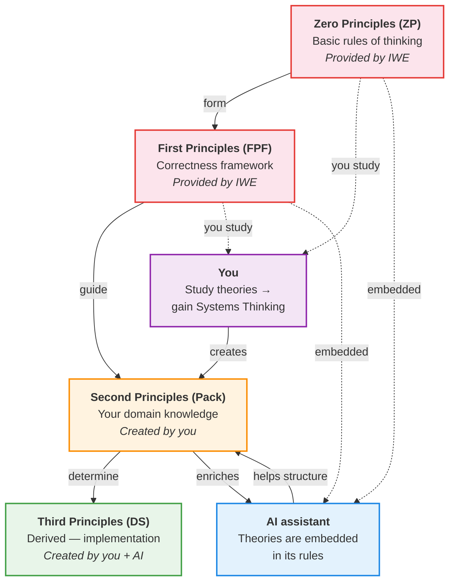

# IWE for Beginners: The Operating System for Intellectual Work

> **Where to start:** Ready to act now → [QUICK-START.md](../QUICK-START.md) (15 minutes). Working via browser (claude.ai), without VS Code → [BROWSER-CI-TEMPLATE.md](../BROWSER-CI-TEMPLATE.md). This file is a conceptual introduction: what IWE is and why you need it.

> **Who this is for:** Anyone who has never heard of IWE and does not know what GitHub, VS Code, or a command line is. That is fine. You are in the right place.
>
> **What you will get:** An Understanding of what IWE is, what it consists of, why it exists — and how to get started without being a programmer.

---

## 1. Your Problem (and It Is Real)

Do any of these sound familiar?

**Knowledge disappears.** You read a book, attend a lecture, take notes — and a month later you cannot find that one idea. Or you find it, but have lost the context. Notes in Notion, a notebook, your phone, a napkin — everywhere and nowhere.

**Plans do not work.** You make a plan for the week, and by Wednesday it is already obsolete. New tasks displace old ones. No priority system, no Review — just the feeling that you never have enough time.

**AI does not really help.** You have tried ChatGPT or Claude and got polished but generic answers. Every time you start from scratch. The AI knows nothing about you: not your projects, not your goals, not what you have already tried.

---

## 2. How IWE Solves This

IWE is an **Intellectual Work Environment** — the operating system for intellectual work. Just as Ubuntu is not simply a collection of programs but a distribution (kernel + packages + Configuration + community), IWE is a methodology + a ready-made Environment + ongoing support.

### Four Components of IWE

```
IWE — the operating system for intellectual work

  Thinking core      — what you think with (theories, principles, Distinctions)
  Work culture       — how you work (Protocols, Skills, formats)
  Mastery model      — where you grow (from Student to Enlightener)
  Community          — where you live (an Environment of Creators)
```

**Important:** IWE is a tool. But behind the tool stand theories (Systems Thinking, management, engineering) and a work culture (14 elements: Protocols, Skills, formats). Without theories the tool remains a notepad with AI. With theories it becomes an exoskeleton for thinking.

### How the Components Address Each Problem

| Problem | IWE Component | How It Works |
|---------|---------------|--------------|
| Knowledge disappears | **Thinking core** (exocortex + Pack) | Every unit of Knowledge has its place. AI helps extract and structure it. Change history is stored in GitHub |
| Plans do not work | **Work culture** (Opening/Work/Closing rituals + Claude Code) | Morning — daily plan (automatically). Evening — summary. Every week — Review. AI prevents unfinished items from being forgotten |
| AI does not help | **Thinking core + work culture** | AI reads YOUR files, knows YOUR goals, remembers YOUR history. This is a personal assistant, not a generic chatbot |
| I do not know where to grow | **Mastery model** | A clear Trajectory: from beginner to expert. Each Mastery stage has specific Skills and outcomes |
| Facing problems alone | **Community** | An Environment of Creators: knowledge sharing, Review, support |

> More on each scenario: [Daily Planning](https://github.com/TserenTserenov/PACK-digital-platform/blob/main/pack/digital-platform/08-service-clauses/DP.SC.001-daily-planning.md) | [Weekly Planning](https://github.com/TserenTserenov/PACK-digital-platform/blob/main/pack/digital-platform/08-service-clauses/DP.SC.002-weekly-planning.md) | [Development and Learning](https://github.com/TserenTserenov/PACK-digital-platform/blob/main/pack/digital-platform/08-service-clauses/DP.SC.003-learning-and-development.md) | [Knowledge Capture](https://github.com/TserenTserenov/PACK-digital-platform/blob/main/pack/digital-platform/08-service-clauses/DP.SC.004-knowledge-capture.md)

---

## 3. Your Path: From Zero to a Working IWE



### Step 1. Understand Why (You Are Already Here)

You are reading this document — that means the first Step is done. You recognize that your current way of working with information does not scale. That is an important realization.

### Step 2. Install the Tools (~20 minutes)

You do **not** need to understand programming. Installing IWE is three actions:

1. Install Claude Code (free)
2. Create a GitHub account (free)
3. Run one command that sets up everything else

> **AI will help.** If you have already installed Claude Code — just tell it: "Help me install IWE." It will walk you through every Step.
>
> Detailed instructions: [SETUP-GUIDE.md](../SETUP-GUIDE.md)

**What you need (minimum):**
- A computer (Mac, Linux, or Windows with WSL)
- A Claude Pro subscription (~$20/month) — for Claude Code
- A GitHub account (free)

### Step 3. First Strategic Session (~30 minutes)

After installation, launch Claude Code and run your first Session:
- Fill in the strategic document (who you are, what matters, where you are heading)
- Define 3–5 Work Products (tasks) for the coming week
- AI structures this into a plan

This is not an abstract exercise — you immediately get a working plan.

> More detail: [SETUP-GUIDE.md, stage 2](../SETUP-GUIDE.md)

### Step 4. Daily Practice (1–2 weeks)

Every day follows the same rhythm:
- **Morning:** "Open the day" → Claude shows the plan, events, and where you left off
- **Work:** You work and record conclusions at Work milestones
- **Evening:** "Close the day" → Claude records the outcomes and updates the plans

After one week you will feel the difference: nothing is lost, everything is in its place.

> More detail: [LEARNING-PATH.md, §5 — Daily Work](../LEARNING-PATH.md)

### Step 5. Systems Thinking (When You Are Ready)

After 1–2 weeks of Practice you will notice that IWE is more than tools. It is built on specific principles. Mastering those principles is the next level. See [section 6](#6-iwe-map-what-is-inside) for details.

---

## 4. Do Not Be Afraid

### "I am not a programmer"

You do not need to be. IWE is an operating system for intellectual work, not for programming. You write texts, plans, notes. GitHub is simply reliable storage. You will not write code.

### "GitHub, CLI, terminal — these are scary"

Only the first time. Here is what you actually need to know:
- **GitHub** — a place where files are stored (like Google Drive, but with history)
- **Terminal** — a window where you type commands as text (Claude Code will tell you what to type)
- **CLI** — simply a way of communicating with your computer through text instead of buttons

After installation you will interact mainly with Claude Code — in plain language.

### "This system is too complex"

IWE is not a monolith you need to master all at once. It is a modular OS. **The IWE onboarding path** — you add Components to your Environment as you need them:

| Stage | What you connect | What you get |
|-------|-----------------|--------------|
| **Stage 1 — Start** | Claude Code + exocortex | A personal AI assistant that remembers you |
| **Stage 2 — Rituals** | + Opening/Work/Closing + daily plan | Structured work without losing context |
| **Stage 3 — Knowledge base** | + Pack + bot | A knowledge base + mobile access |
| **Stage 4 — Automation** | + Roles + agents | AI agents that work independently |

> **Stages = what you physically set up in your Environment** (not a Mastery stage, not an access tier). Do not confuse: "Steps 1–4" above = the order for first-time onboarding; Platform access tiers (T0→T4) → [DP.ARCH.002]; Development stage (cp-profile) → FORM.089. More on access tiers: [LEARNING-PATH.md, §9](../LEARNING-PATH.md).

### "Will AI do everything for me?"

No. And this is a fundamental point. IWE is an **exoskeleton, not a prosthetic**.

- A **prosthetic** replaces a capability. You stop thinking because AI thinks for you.
- An **exoskeleton** extends a capability. It is a partner that lives on your laptop, phone, and in robots. You think better because AI handles the routine: reminding, structuring, finding connections.

Your thinking is the primary resource. AI helps you avoid wasting it on searching for a file or reconstructing context.

> More detail: [Principles vs Skills](../principles-vs-skills.md)

---

## 5. Four Components in Detail

### Thinking Core — What You Think With

IWE is grounded in concrete **theories**: Systems Thinking, management, enterprise engineering, methodology. These theories are organized into a hierarchy of principles (ZP → FPF → Pack → DS) and embedded in the AI assistant's rules. See [section 7](#7-theories-and-work-culture--the-foundation-of-iwe) for details.

**Exocortex** — your second Memory. A set of files that the AI assistant (Claude Code) reads and updates. When you start work it knows where you left off yesterday. When you finish it records the conclusions. You no longer lose context between Sessions.

**Pack** — a knowledge base for a Domain. If you are studying marketing, for example, your summaries, rules, and Distinctions accumulate into a Pack. This is not a folder of bookmarks. It is a structured library where every unit of Knowledge is in its place.

### Work Culture — How You Work

Work culture is not an abstract value. It consists of **14 concrete elements** grouped into three types:

| Type | What It Is | Examples |
|------|-----------|---------|
| **Protocols** | Formalized sequences (follow step by step) | Opening/Work/Closing, ArchGate, Day Open/Day Close |
| **Skills** | What you develop (apply situationally) | Capture, Self-correction, Distinctions |
| **Formats** | How you present results (to a standard) | Pack structure, WP-context, Collapsible sections |

**Opening/Work/Closing rituals** — the main Protocol. A simple pattern repeated at every scale. Start the day — Opening (what am I doing today?). Work — Work (record Knowledge at Work milestones). Finish — Closing (what did I accomplish, what is next).

### Mastery Model — Where You Grow

A clear Trajectory from beginner to expert. Each Mastery stage has specific Skills and outcomes. You always know where you stand and what to learn next.

### Community — Where You Live

An Environment of Creators: knowledge sharing, Review, support. Not a Q&A forum, but a place where culture and meaning take shape.

### You + Claude Code = a Pair

At the center of IWE is **you**. You make decisions, think, set direction. Claude Code is your Peer partner: it amplifies, structures, and handles the routine. But the decisions always belong to you.

### Tools (Delivery Mechanisms)

Tools are not IWE. They are the **delivery mechanisms** for the four components.

**Claude Code** — an AI assistant that works directly in the terminal. It does not just answer questions — it reads your files, helps with planning, and reminds you of unfinished work. It is your Peer partner, not a search engine.

**GitHub** — cloud storage with a full change history. You can always return to any version of any file.

**VS Code** — a free editor. You do not need it at the start — Claude Code works in the terminal. VS Code becomes useful later, when you want to browse files on your own.

**Bot @aist_me_bot** — an assistant in Telegram. It answers questions from your knowledge base and reminds you of tasks. You do not need to open your computer to stay connected to IWE.

More on theories — in the [following sections](#6-iwe-map-what-is-inside).

---

## 6. IWE Map: What Is Inside

Now that you know what each component is for — here is how they connect:



**Four components — and you at the center:**

| Component | What It Is | Simple Analogy |
|-----------|-----------|---------------|
| **Thinking core** | Theories + exocortex + Pack. The foundation everything is built on | Operating system (Linux kernel) |
| **Work culture** | Protocols, Skills, formats — 14 elements | Standard utilities (ls, grep, git) |
| **Mastery model** | Trajectory from beginner to expert | Package manager (apt install) |
| **Community** | Environment of Creators: sharing, Review, support | Forum + repositories (GitHub community) |

> **Tools** (Claude Code, VS Code, GitHub, bot) are delivery mechanisms — like the hardware the OS runs on.

---

## 7. Theories and Work Culture — the Foundation of IWE

You can install all the tools, set up rituals, and start keeping plans — and still not get the most out of IWE. Why?

Because **IWE is a tool, but behind the tool stand theories and work culture**. Without them the tool remains a notepad with AI.

### Theories: Where Principles Come From

IWE is grounded in a body of theories taught in courses at the [School of Systems Management](https://system-school.ru/):
- **Systems Thinking** — seeing the whole, not just the parts
- **Methodology** — Distinctions, method descriptions, Work Products
- **Enterprise engineering** — how organizations and projects are structured
- **Management** — leadership, direction, strategizing

These theories are organized into a hierarchy of principles:



| Level | Who Creates It | Who Uses It | Example |
|-------|---------------|-------------|---------|
| **Zero (ZP)** | IWE | You + AI | Basic rules of thinking |
| **First (FPF)** | IWE | You + AI | Correctness framework, Distinctions |
| **Second (Pack)** | You | You + AI | Your Knowledge in marketing, management, engineering |
| **Third (DS)** | You + AI | You + AI | Specific plans, code, processes |

### Work Culture: 14 Elements

Work culture is the second component of IWE. It is not "motivation" or "habits." It is a **designable set of methods** grouped into three types:

| Type | What It Is | Examples | How It Is Developed |
|------|-----------|---------|---------------------|
| **Protocols** | You follow step by step (formalized) | Opening/Work/Closing, ArchGate, Day Open/Day Close | Follow the instructions → becomes automatic |
| **Skills** | You apply situationally (built through Practice) | Capture, Self-correction, Distinctions | Practice → feedback → Mastery |
| **Formats** | You produce output to a standard | Pack structure, WP-context | Use the Template → it becomes habit |

Work culture is what gets results. Tools can be copied and theories can be read. But an established work culture is the product of Practice that cannot be skipped.

### What Systems Thinking Is (In Plain Terms)

It is the **outcome** of studying theories and applying work culture. The ability to see the **whole**, not just the parts:

- You plan the week. Without Systems Thinking — a list of tasks. With it — an Understanding of which tasks are connected, which one blocks another, what is strategically more important.
- You read a book. Without Systems Thinking — a summary of quotes. With it — Distinctions and principles that can be applied in different contexts.
- You use AI. Without Systems Thinking — random questions. With it — precise prompts, because you understand the structure of your work.

### Why IWE Does Not Reach Its Potential Without This

IWE uses specific Concepts from those theories:

| Concept | From Which Theory | Where in IWE | What It Means |
|---------|-------------------|-------------|---------------|
| **Distinctions** | Methodology | Pack, exocortex | Precisely defining how one thing differs from another |
| **Method descriptions** | Methodology | Opening/Work/Closing rituals | Understanding "how," not just "what" |
| **Work Products** | Systems engineering | Planning, Review | Focus on outcomes, not activities |
| **Roles** | Management | Strategist, Extractor | Separation: who does what (including AI) |

You can start using IWE **without** a deep Understanding of these Concepts. But to truly unlock its potential — it is worth working through them. And the more you study, the smarter your AI Peer partner becomes, because you fill the Pack with Knowledge.

### How to Start Learning

1. **First week:** Just use IWE. Get used to the Opening/Work/Closing rituals. Do not go deep into theory.
2. **Second week:** Read [Principles vs Skills](../principles-vs-skills.md) — a 10-minute introduction to the philosophy of IWE.
3. **After that:** Study [LEARNING-PATH.md, §3 — Thinking Foundation](../LEARNING-PATH.md) at your own pace. The bot @aist_me_bot will help with questions.

> Recommended courses: [School of Systems Management](https://system-school.ru/) — the courses whose theories IWE is built on. Start with: "Systemic Self-Development," "Systems Thinking," "Methodology."

---

## Links and Resources

### Start Now

| Resource | What It Is | Link |
|----------|-----------|------|
| Step-by-step installation | 7 stages, from zero to a working IWE | [SETUP-GUIDE.md](../SETUP-GUIDE.md) |
| Learning path | Full mastery program (11 sections) | [LEARNING-PATH.md](../LEARNING-PATH.md) |
| Quick reference | FAQ + 4-day plan | [LEARNING-PATH.md, §11](../LEARNING-PATH.md) |

### Go Deeper

| Resource | What It Is | Link |
|----------|-----------|------|
| What IWE is | Core definition, Architecture, perimeters | [DP.IWE.001](https://github.com/TserenTserenov/PACK-digital-platform/blob/main/pack/digital-platform/02-domain-entities/DP.IWE.001-intelligent-working-environment.md) |
| Template and setup | Components, Roles, FAQ | [DP.IWE.002](https://github.com/TserenTserenov/PACK-digital-platform/blob/main/pack/digital-platform/02-domain-entities/DP.IWE.002-iwe-template-and-setup.md) |
| Principles vs Skills | Why principles matter more than tools | [principles-vs-skills.md](../principles-vs-skills.md) |
| Terminology | IWE glossary | [ONTOLOGY.md](../../ONTOLOGY.md) |

### Usage Scenarios

| Scenario | Promise | Link |
|----------|---------|------|
| Daily planning | DayPlan by 08:00 with priorities and context | [DP.SC.001](https://github.com/TserenTserenov/PACK-digital-platform/blob/main/pack/digital-platform/08-service-clauses/DP.SC.001-daily-planning.md) |
| Weekly planning | WeekPlan (with a "Results W{N}" section) | [DP.SC.002](https://github.com/TserenTserenov/PACK-digital-platform/blob/main/pack/digital-platform/08-service-clauses/DP.SC.002-weekly-planning.md) |
| Development and learning | Q&A, homework review, marathons | [DP.SC.003](https://github.com/TserenTserenov/PACK-digital-platform/blob/main/pack/digital-platform/08-service-clauses/DP.SC.003-learning-and-development.md) |
| Knowledge capture | Fleeting notes → Pack | [DP.SC.004](https://github.com/TserenTserenov/PACK-digital-platform/blob/main/pack/digital-platform/08-service-clauses/DP.SC.004-knowledge-capture.md) |

### Compatibility and Cost

| Parameter | Value |
|-----------|-------|
| OS | macOS, Linux, Windows (via WSL) |
| Required subscription | Claude Pro (~$20/month) |
| GitHub | Free |
| VS Code | Free (needed later, not at the start) |
| Programming knowledge required | No |

> More detail: [PLATFORM-COMPAT.md](../PLATFORM-COMPAT.md) | [FAQ in DP.IWE.002, §11](https://github.com/TserenTserenov/PACK-digital-platform/blob/main/pack/digital-platform/02-domain-entities/DP.IWE.002-iwe-template-and-setup.md)

---

*Created: 2026-03-17 | Updated: 2026-03-27 | WP-120 | [FMT-exocortex-template](https://github.com/TserenTserenov/FMT-exocortex-template)*